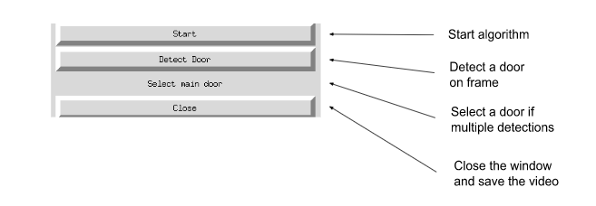
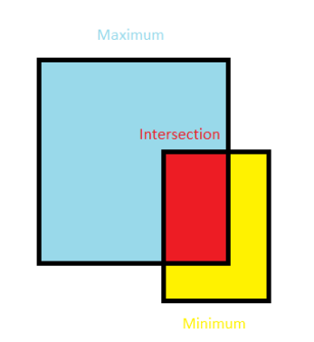
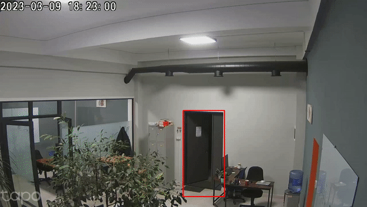
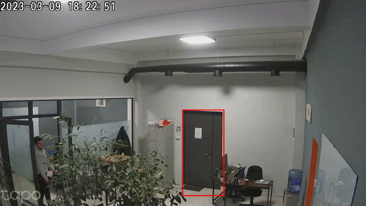
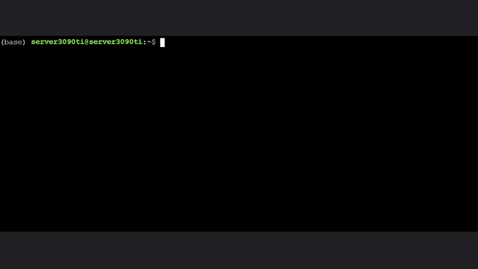

# Person In/Out
This repository is based on original YoloV5 repository, with integrated person In/Out detection algorithm.
To get directions on how to download door detection model, visit models/README.txt!

## 1. GUI Description:
Our algorithm uses YoloV5 for person and door detection. 
When the app.py file is activated, a GUI menu appears, and offers to start. After clicking the ‘start’ button, the view from the camera opens and when ‘detect door’ is clicked, the algorithm starts to function. 
  

  

## 2. Algorithm Description:

The In/Out algorithm is implemented in a straightforward way. After a door is detected by door Yolo, Person Yolo turns on and works until the window is closed.
When a person is located closer than a threshold distance from the door (called a threshold zone arround the door), he is detected by Yolo. After the person disappears from Yolo sight, it takes the person’s bounding box from the last frame where he/she was visible, and Computes IoM (Intersection over minimum) of the bounding box and the door. If the IoM is greater than a threshold - “out”, if it is smaller - “In”. 

  

## 3. Some examples of In/Out events:
<table style="width:100%">
  <tr>
    <th>Camera</th>
    <th>In/Out event</th>
    <th>Gif</th>
  </tr>
  <tr>
    <td>Cam. 1</td>
    <td>In</td>
    <td>
        

          
        

    </td>
  </tr>
  <tr>
    <td>Cam. 2</td>
    <td>Out</td>
    <td>
        

          
        

    </td>
  </tr>
  <tr>
    <td>Cam. 3</td>
    <td>In</td>
    <td>
        

          
        

    </td>
  </tr>
  <tr>
    <td>Cam. 4</td>
    <td>Out</td>
    <td>
        

          
        

    </td>
  </tr>
</table>

## 4. How to use application:
Here you can see a guide on how to create an anaconda env., download dependencies and run the application:

  

